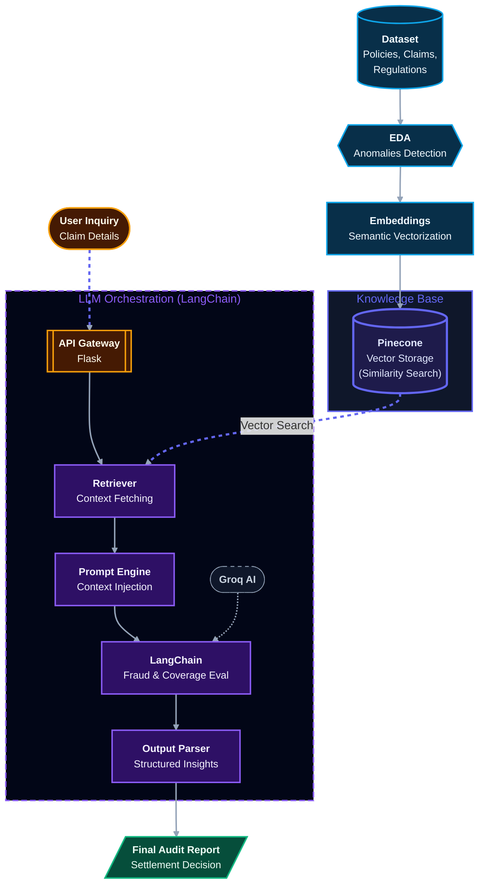
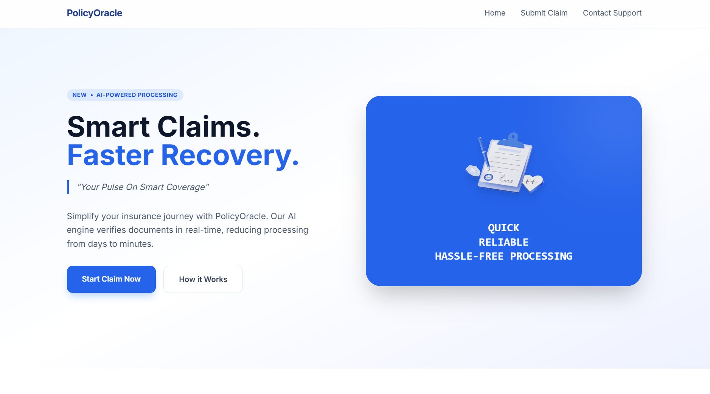
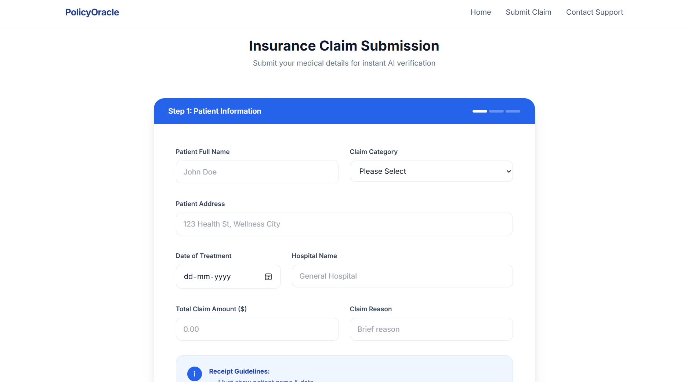
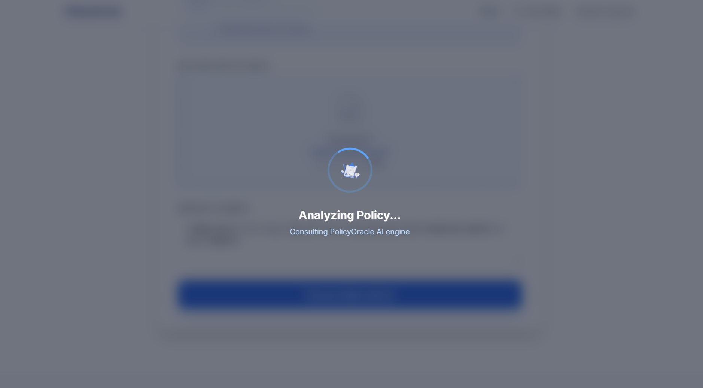
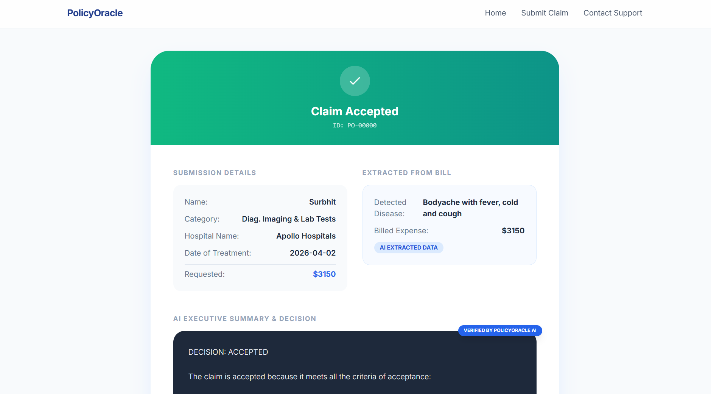

# PolicyOracle - AI Powered Insurance Claim Intelligence
PolicyOracle is an advanced RAG (Retrieval-Augmented Generation) framework designed to automate the lifecycle of insurance claim processing—from raw data ingestion to final audit reporting.

## Problem Statement: 
Traditional healthcare claim processing is plagued by extreme complexity and the massive influx of unstructured medical data. Patient records, diagnostic reports, prescriptions, and billing documents often arrive in inconsistent formats, making manual workflows slow and error-prone.

**⏳ Time-Consuming:** Manual verification of medical codes, treatment histories, and billing details delays claim approvals.

**⚠️ Error-Prone:** Human oversight in interpreting clinical notes or insurance codes leads to rejected or disputed claims.

**💰 Operational Costs:** Inefficient workflows increase administrative overhead for hospitals, insurers, and third-party administrators.

**📜 Regulatory Compliance:** Healthcare claims must adhere to strict standards (ICD codes, HIPAA, IRDAI guidelines in India, etc.), and manual errors risk non-compliance.

**🤝 Patient Trust:** Delays or inaccuracies in claim settlements directly erode confidence in healthcare providers and insurers.

## Solution: 
PolicyOracle addresses these challenges by providing a seamless, automated healthcare claim processing pipeline. It leverages Generative AI and a smart RAG (Retrieval-Augmented Generation) system to handle the complexities of medical claims—from unstructured data ingestion to final settlement decisions.

By automating these workflows, PolicyOracle reduces manual effort, ensures accuracy, and maintains compliance with healthcare regulations.

## Features: 

### Healthcare Claim Processing Pipeline

1. **Automated Data Ingestion**: Gathers and structures unstructured medical data from various sources (patient records, diagnostic reports, claims, etc.).

2. **RAG System**: Uses a smart Retrieval-Augmented Generation system to ensure accurate, context-aware claim analysis.

3. **Claim Validation**: Analyzes claim validity, checks coverage, and ensures compliance with regulations.

4. **Settlement Recommendations**: Generates accurate settlement recommendations with supporting evidence.

5. **Compliance Assurance**: Maintains high standards of regulatory compliance (ICD, HIPAA, IRDAI, etc.).

6. **Efficiency & Accuracy**: Reduces manual effort, ensures consistency, and minimizes errors in claim processing.

## Architecture:


### 🛠 Workflow Deep Dive

#### 🛰 1. Data Ingestion & EDA
PolicyOracle aggregates customer, medical, and regulatory datasets, performing automated **Exploratory Data Analysis (EDA)** to validate integrity and identify anomalies. This ensures the AI operates on high-context, verified, and clean data.

#### 🧬 2. Embedding & KnowledgeBase (Pinecone)
Textual data is converted into high-dimensional **Vector Embeddings** to capture complex semantic nuances. These vectors are indexed in a local **Pinecone** database, creating a high-performance knowledge base for similarity-based retrieval.

#### 🧠 3. LangChain Retrieval & Orchestration
When a user submits a claim via the **Flask**, the system triggers a **LangChain Retriever**. This component performs a vector search against the Pinecone index to fetch the most relevant policy context. High-performance **Groq AI** LLMs then evaluate the claim using:
*   **Contextual Reasoning**: Merging user queries with fetched policy snippets.
*   **Fraud Detection**: Identifying inconsistent patterns across dataset history.
*   **Coverage Verification**: Automatically mapping claims to specific policy limits and terms.

#### 📝 4. Structured Parsing & Final Reporting
The raw LLM output is refined through **Structured Parsing** (Pydantic validation) to ensure actionable insights and zero-hallucination results. This culminates in a **Final Audit Report** with automated settlement decisions, drastically reducing total processing time.


## 🖼️ Application Walkthrough

| **Step 1: Home Page** | **Step 2: Claim Document Upload** |
|:---:|:---:|
|  |  |
| **Home Page** <br> A sleek, intuitive dashboard serving as the central hub for automated healthcare claim processing and intelligence. | **Claim Document Upload** <br> A seamless interface for securely uploading medical claims, PDF diagnostic reports, and billing documents for validation. |

| **Step 3: AI Claim Validation** | **Step 4: Final Audit Report** |
|:---:|:---:|
|  |  |
| **AI Claim Validation** <br> Advanced context-aware analysis powered by Groq AI and a Retrieval-Augmented Generation (RAG) system to evaluate claim validity against policy guidelines. | **Final Audit Report** <br> Detailed settlement breakdown providing claim decisions (ACCEPTED/REJECTED), AI-generated reasoning, and a downloadable PDF audit report. |


## 🛠️ Tech Stack

- **Backend Framework:** Flask
- **Large Language Model:** Groq AI (Llama 3.3-70b-versatile)
- **AI Orchestration:** LangChain
- **Vector Database:** Pinecone (RAG)
- **Data Processing:** Pandas, NumPy
- **Frontend:** HTML, Tailwind CSS, JavaScript


## 🔄 Claim Processing Pipeline

1. **Home Page Form**  
   Users begin by accessing the home page, where a structured claim form is displayed.

2. **Claim Submission**  
   The user fills out the form and uploads their medical bill for processing.

3. **Data Extraction (LLM)**  
   A Large Language Model (LLM) parses the uploaded bill, converting unstructured medical text into structured data.

4. **Policy Context Retrieval (RAG + Pinecone)**  
   A Retrieval-Augmented Generation (RAG) system queries Pinecone to fetch relevant insurance policy clauses and coverage rules.

5. **Pipeline Orchestration (LangChain)**  
   LangChain coordinates the workflow, ensuring smooth integration between extraction, retrieval, and evaluation.

6. **Claim Evaluation (LLM)**  
   The LLM evaluates the claim against the retrieved policy context, grounding decisions in actual coverage terms.

7. **Structured Validation**  
   Schema enforcement and structured parsing guarantee accuracy, eliminating hallucinations and ensuring compliance.

8. **Final Audit Report**  
   A transparent, audit-ready report is generated with the settlement decision, supporting trust and regulatory requirements.


## 📂 Project Structure

```text
PolicyOracle/
│
├── BillExtraction/               # Logic for extracting structured data from raw medical bills
│   ├── Bills/                    # Storage for uploaded and processed medical bills
│   └── bill_extraction.py        # LLM-powered extraction logic
│
├── Notebooks/                    # Jupyter notebooks for EDA and experimentation
│
├── documents/                    # Reference documents and policy PDFs used for the RAG knowledge base
│   ├── MembershipHandbook.pdf    # Sample policy document
│   └── ...
│
├── static/                       # Static frontend assets
│   ├── css/                      # Stylesheets
│   ├── images/                   # Dashboard and UI images
│   └── js/                       # JavaScript for interactivity
│
├── templates/                    # HTML templates
│   └── home.html                 # Main dashboard and document upload interface
│
├── .env                          # Environment variables (API keys, Pinecone configuration)
├── embedding.py                  # Embedding generation setup (e.g., HuggingFace embeddings)
├── knowledgebase.py              # Logic to chunk PDFs, embed text, and interact with Pinecone Vector DB
├── main.py                       # Main Flask application, API routing, and LangChain orchestration
├── requirements.txt              # Project dependencies
└── README.md                     # Project documentation
```

## 🔧 Installation & Usage

### Prerequisites
- Python 3.12
- [Groq AI API Key](https://console.groq.com/)
- [Pinecone API Key](https://app.pinecone.io/)

### 1. Clone the Repository
```bash
git clone https://github.com/alokprasad573/PolicyOracle.git
cd PolicyOracle
```

### 2. Set Up a Virtual Environment (Recommended)
**Windows:**
```bash
python -m venv .venv
.venv\Scripts\activate
```

**macOS/Linux:**
```bash
python3 -m venv .venv
source .venv/bin/activate
```

### 3. Install Dependencies
```bash
pip install -r requirements.txt
```

### 4. Configure Environment Variables
Ensure you have a `.env` file in the root directory with your API keys:
```env
GROQ_API_KEY=your_groq_api_key_here
PINNECONE_API_KEY=your_pinecone_api_key_here
```

### 5. Run the Application
Start the Flask development server:
```bash
python main.py
```

### 6. Access the Dashboard
Open your web browser and navigate to:
```text
http://127.0.0.1:5000/
```
From here, you can upload a medical claim document to test the AI evaluation workflow!'

## 🤝 Contributions
Contributions, issues, and feature requests are welcome! Feel free to check the [issues page](https://github.com/alokprasad573/PolicyOracle/issues) if you want to contribute.

1. Fork the Project
2. Create your Feature Branch (`git checkout -b feature/AmazingFeature`)
3. Commit your Changes (`git commit -m 'Add some AmazingFeature'`)
4. Push to the Branch (`git push origin feature/AmazingFeature`)
5. Open a Pull Request

## 📄 License
This project is licensed under the MIT License. See the [LICENSE](LICENSE) file for details.
