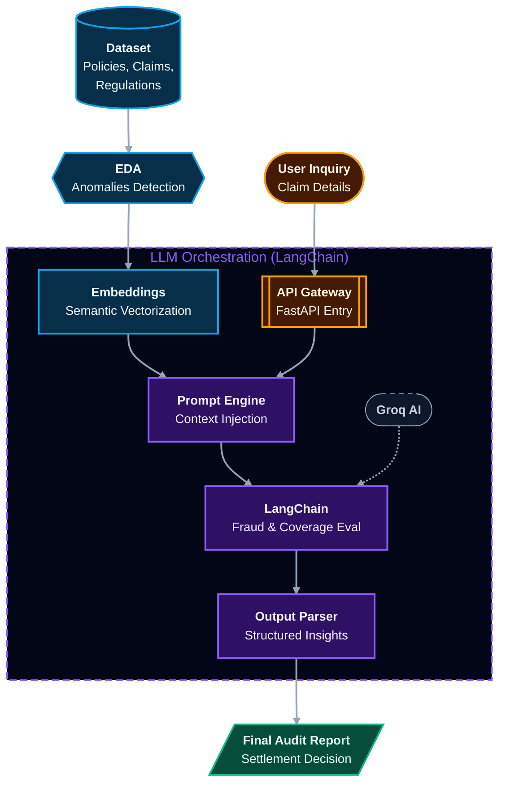

# PolicyOracle - AI Powered Insurance Claim Intelligence
PolicyOracle is an advanced RAG (Retrieval-Augmented Generation) framework designed to automate the lifecycle of insurance claim processing—from raw data ingestion to final audit reporting.

## Problem Statement: 
Traditional insurance claim processing in the finance and banking sectors is often hindered by extreme complexity and massive volumes of unstructured data. These manual workflows are notoriously time-consuming and prone to human error, directly impacting operational costs, regulatory compliance, and customer trust.

## Solution: 
PolicyOracle addresses these challenges by providing a seamless, automated claims processing pipeline. It leverages advanced Generative AI to extract critical information from policy documents, analyze claim validity, and generate accurate settlement recommendations. By automating these complex workflows, PolicyOracle significantly reduces manual effort, ensures consistency, and maintains high standards of regulatory compliance.

## Features: 
- Policy Document Analysis: Extracts relevant information from policy documents using advanced AI algorithms.
- Claim Analysis: Analyzes claims and provides accurate settlement recommendations.
- Streamlined Workflow: Streamlines the claims process, reduces manual effort, and ensures consistent and reliable claim settlements.

## Architecture:

### 🛠 Workflow Deep Dive

#### 🛰 1. Data Ingestion & EDA
PolicyOracle aggregates customer, medical, and regulatory datasets, performing automated **Exploratory Data Analysis (EDA)** to validate integrity and identify anomalies. This ensures the AI operates on high-context, verified, and clean data.

#### 🧬 2. Embedding Generation
Textual data is converted into high-dimensional **Vector Embeddings** to capture complex semantic nuances. This allows the system to bridge unstructured documents with efficient retrieval, enabling rapid claim validation against specific policy terms.

#### 🧠 3. LLM Orchestration
The **LangChain** layer triggers high-performance **Groq AI** LLMs to evaluate claims by merging user queries with retrieved context. The system performs "deep-dive" assessments including:
*   **Fraud Detection**: Identifying inconsistent patterns.
*   **Coverage Verification**: Mapping claims to policy limits.
*   **Settlement Calculation**: Providing data-driven payout recommendations.

#### 📝 4. Parsing & Final Reporting
The raw LLM output is refined through **Structured Parsing** (Pydantic) to ensure actionable insights and zero-hallucination results. This culminates in a **Final Audit Report** that accelerates the approval process and drastically reduces settlement time-to-completion.
